Initial\_Analysis
================
Nikolas Krstic, Xinyao Fan, Tom Hyeongcheol Park
March 14, 2018

``` r
if (!require('ordinal')) install.packages('ordinal')
if (!require('rms')) install.packages('rms')
if (!require('corrplot')) install.packages('corrplot')
if (!require(devtools)) install.packages("devtools")
library(haven)
library(MASS)
library(ordinal)
library(leaps)
library(rms)
devtools::install_github("kassambara/ggpubr")
library(ggpubr)
library(ggplot2)
library(vcd)
```

Data Cleaning
-------------

``` r
##Data Cleaning
wd = substr(getwd(), 1, nchar(getwd())-4)
MAIN_data = read_sav(paste(wd, "/Data/Data-NFEHRS_revised.sav", sep=""))

#Handle data artifacts
MAIN_data[MAIN_data$num_use==7,]$num_use = NA
MAIN_data[MAIN_data$ED_Level==8,]$ED_Level = 4

#Boolean, which decides whether to combine classes of skill usage or convert them to sums
collapsing=TRUE

if(collapsing){
  MAIN_data$num_use_new = floor(MAIN_data$num_use)#change the floating points to 4 categories. We can see the num_use_new is changed to categories later.
  MAIN_data[MAIN_data$num_use_new %in% c(5),]$num_use_new = 4
  MAIN_data$lit_use_new = floor(MAIN_data$liter_use)
  MAIN_data[MAIN_data$lit_use_new %in% c(5),]$lit_use_new = 4
}else{
  MAIN_data$num_use_new = MAIN_data$num_use*18
  MAIN_data$lit_use_new = MAIN_data$liter_use*12
}
  
FactorList = c("pub_priv", "GENDER_R", "ED_Level", "Full_part", "NFE12", "FNFAET12NJR", "FNFAET12JR",
               "lit_use_new", "num_use_new")

MAIN_data[FactorList] = lapply(MAIN_data[FactorList], as.factor)

#Remove variables and make two datasets, one for each response type
Var_Removal = c("AGEG5LFS", "AGEG10LFS", "Mgr", "Mgr_c", "pvlitM", "pvnumM", "FNFE12JR", "FNFAET12", "EMPloyed",
                "FNFAET12JR", "FNFAET12NJR", "NFEHRS")

Lit_data = MAIN_data[!(names(MAIN_data) %in% c("num_use_new", "liter_use", "num_use", Var_Removal))]
Num_data = MAIN_data[!(names(MAIN_data) %in% c("lit_use_new", "liter_use", "num_use", Var_Removal))]

Num_data_clean = na.omit(Num_data)
Lit_data_clean = na.omit(Lit_data)

#Check for Correlations
Subset_Data = MAIN_data[,c("AGE_R","Years_wk","work_flexM","work_lrnM","act_lrn","NFEHRS")]
numericlist = c("lit_use_new", "num_use_new")
Subset_Data[numericlist] = lapply(MAIN_data[numericlist], as.numeric)
CorrMatrix = cor(Subset_Data, use="pairwise.complete.obs")

#Eliminated both "FNFAET12NJR" and "FNFAET12JR" since they sum to make NFE12 (causing issues with modelling)
table(as.numeric(MAIN_data$FNFAET12JR)+as.numeric(MAIN_data$FNFAET12NJR), MAIN_data$NFE12)
```

    ##    
    ##       0   1
    ##   2 710   0
    ##   3   3 534

``` r
table(MAIN_data$FNFAET12NJR, MAIN_data$NFE12)
```

    ##    
    ##       0   1
    ##   0 710 427
    ##   1   3 107

``` r
table(MAIN_data$FNFAET12NJR, MAIN_data$FNFAET12JR)
```

    ##    
    ##       0   1
    ##   0 710 427
    ##   1 110   0

``` r
table(MAIN_data$NFEHRS>0, MAIN_data$NFE12)
```

    ##        
    ##           0   1
    ##   FALSE 713   0
    ##   TRUE    0 534

Model Selection
---------------

``` r
##Ordinal Regression (Literacy) (Backward Selection)

Null_Model_1 = clm(num_use_new~1, data=Num_data_clean, Hess=TRUE)
Full_Model_1 = clm(num_use_new~., data=Num_data_clean, Hess=TRUE)

Num_Model = step(Full_Model_1, trace=T, scope=list(upper = Full_Model_1, lower = Null_Model_1))


##Ordinal Regression (Numeracy) (Backward Selection)

Null_Model_2 = clm(lit_use_new~1, data=Lit_data_clean, Hess=TRUE)
Full_Model_2 = clm(lit_use_new~., data=Lit_data_clean, Hess=TRUE)

Liter_Model = step(Full_Model_2, trace=T, scope=list(upper = Full_Model_2, lower = Null_Model_2))


## Exhaustive model selection
#NOTE: Make sure the response variable is the last column in your dataset (otherwise the function will not work)
Exhaustive_OLR_Model_Selection = function(data){
  
  #Number of predictors
  PredNum = ncol(data)-1
  
  #Subtract 1 because last combination is the null model
  AICSet = rep(NA, 2^(PredNum)-1)
  #iterate through every combination of predictors
  for(i in 1:(2^(PredNum)-1)){
    if(i%%100==0){
      print(i)
    }
    #Obtain combination of variables for this 
    VarNums = which(as.numeric(substr(as.character(intToBits(i)), 2,2))[1:PredNum]==1)
    ResponseName = names(data)[ncol(data)]
    PredictorNames = names(data)[VarNums]
    
    M_Formula = as.formula(paste(ResponseName, "~", paste(PredictorNames, collapse="+"), sep=""))
    
    Model = clm(M_Formula, data=data, Hess=TRUE)
    
    AICSet[i] = AIC(Model)
  }
  
  Optim = which.min(AICSet)
  
  VarNums_F = which(as.numeric(substr(as.character(intToBits(Optim)), 2,2))[1:PredNum]==1)
  ResponseName_F = names(data)[ncol(data)]
  PredictorNames_F = names(data)[VarNums_F]
    
  M_Formula_F = as.formula(paste(ResponseName_F, "~", paste(PredictorNames_F, collapse="+"), sep=""))
    
  Model_F = clm(M_Formula_F, data=data, Hess=TRUE)
    
  return(Model_F)
}

#Results seem to suggest the results are the same as backward selection
E_Model_Num = Exhaustive_OLR_Model_Selection(Num_data_clean)
E_Model_Lit = Exhaustive_OLR_Model_Selection(Lit_data_clean)
```

Exploratory Analysis
--------------------

``` r
#covariance plot for numerical variables-> No correlation
#newdata.numeric<-Subset_Data[,c("AGE_R","Years_wk","work_flexM","work_lrnM","act_lrn","NFEHRS","pvlitM","pvnumM")]
numericlist = c("lit_use_new", "num_use_new")

Subset_Data[numericlist] = lapply(MAIN_data[numericlist], as.numeric)

Subset_Data <- na.omit(Subset_Data)
#as.numeric()
m<-cor(Subset_Data)
corrplot(m, method = "circle")
```

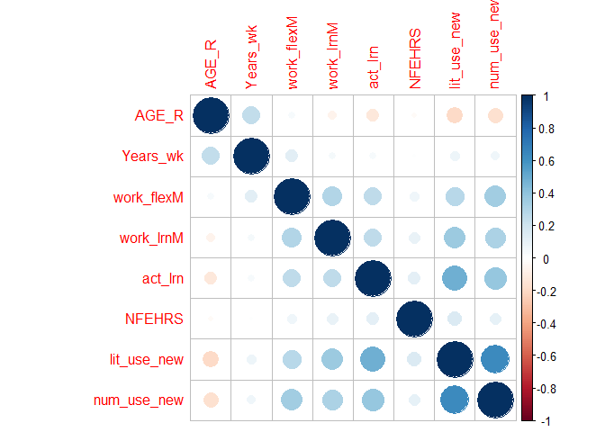

``` r
#covariance matrix for categorical variables-> No correlation
categorical<-c("pub_priv", "GENDER_R", "ED_Level", "Full_part", "NFE12", "lit_use_new", "num_use_new")
catcorrm <- function(categorical, MAIN_data) {
  sapply(categorical, function(y) {
    sapply(categorical, function(x) {
assocstats(table(unlist(MAIN_data[,x]), unlist(MAIN_data[,y])))$cramer
      })
    })
  }
catcorrm(categorical,MAIN_data) 
```

    ##               pub_priv   GENDER_R  ED_Level  Full_part      NFE12
    ## pub_priv    1.00000000 0.03782015 0.2885293 0.03307838 0.32152314
    ## GENDER_R    0.03782015 1.00000000 0.2212229 0.20735923 0.07640968
    ## ED_Level    0.28852928 0.22122294 1.0000000 0.12642832 0.40444507
    ## Full_part   0.03307838 0.20735923 0.1264283 1.00000000 0.12624863
    ## NFE12       0.32152314 0.07640968 0.4044451 0.12624863 1.00000000
    ## lit_use_new        NaN 0.25583563 0.3569872 0.21555545 0.43971028
    ## num_use_new 0.06557372 0.14685213 0.2466351 0.17230115 0.27437505
    ##             lit_use_new num_use_new
    ## pub_priv            NaN  0.06557372
    ## GENDER_R      0.2558356  0.14685213
    ## ED_Level      0.3569872  0.24663509
    ## Full_part     0.2155555  0.17230115
    ## NFE12         0.4397103  0.27437505
    ## lit_use_new   1.0000000         NaN
    ## num_use_new         NaN  1.00000000

``` r
#only FNFAET12JR and NFE12 have very strong correlation(0.83376057)
```

``` r
#bar plot for two response variables.
MAIN_data_response=MAIN_data[c('num_use_new','lit_use_new')]
MAIN_data_response=na.omit(MAIN_data_response)
a <- ggplot(MAIN_data_response) + 
  geom_bar(aes(x=num_use_new), color="black", fill="grey",alpha = 0.8)+ geom_bar(aes(x=lit_use_new),color="red", fill="red",alpha = 0.1)+labs(caption = "Red bar=Literacy
                                                                                                                                              Grey bar= Numeracy", x="Scaled score",y="Count")
a
```

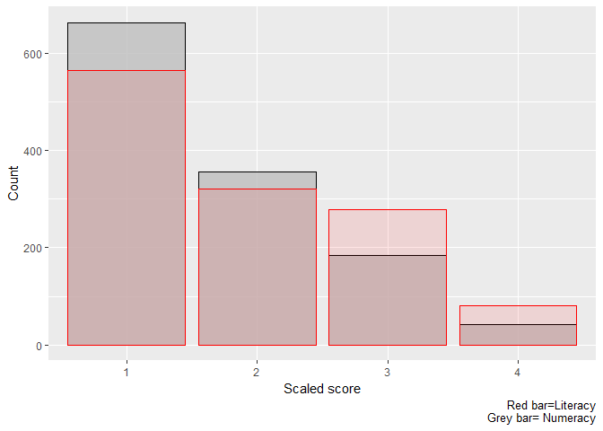

``` r
FactorList = c("lit_use_new", "num_use_new")

MAIN_data[FactorList] = lapply(MAIN_data[FactorList], as.numeric)
# lit_use_new vs gender
(ggplot(MAIN_data, aes(y=lit_use_new, x=GENDER_R,color=GENDER_R)) + geom_boxplot()+stat_summary(fun.y=mean, geom="point", shape=23, size=4))
```

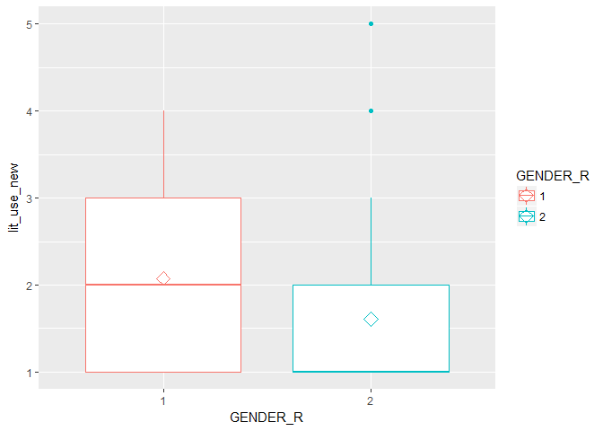

``` r
# lit_use_new vs full/part time
(ggplot(MAIN_data, aes(y=lit_use_new, x=Full_part,color=Full_part)) + geom_boxplot()+stat_summary(fun.y=mean, geom="point", shape=23, size=4,color='blue'))
```

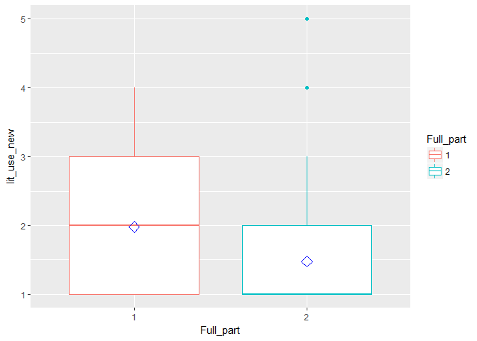

``` r
# lit_use_new vs education
b <- ggplot(MAIN_data, aes(y=lit_use_new, x=ED_Level, color=ED_Level)) + geom_boxplot()+stat_summary(fun.y=mean, geom="point", shape=23, size=4)
b
```

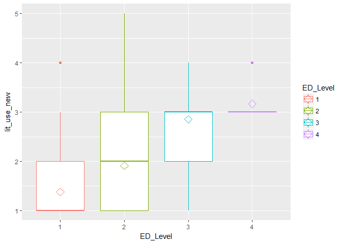

``` r
#MAIN_data_response=na.omit(MAIN_data_response)
# lit_use_new vs private/public

c <- ggplot(na.omit(MAIN_data[c('lit_use_new','pub_priv')]), aes(y=lit_use_new, x=pub_priv, color=pub_priv)) + geom_boxplot()+stat_summary(fun.y=mean, geom="point", shape=23, size=4)
c
```

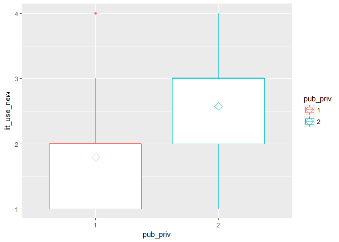

``` r
# lit_use_new vs None formal education
d <- ggplot(MAIN_data, aes(y=lit_use_new, x=NFE12,color=NFE12)) + geom_boxplot()+stat_summary(fun.y=mean, geom="point", shape=23, size=4)
d
```

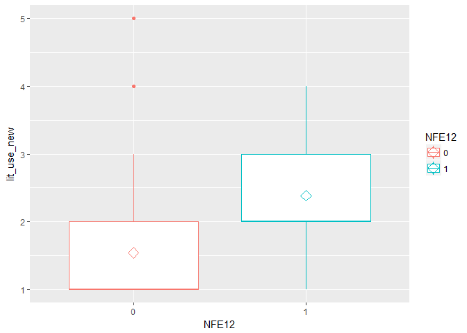

``` r
###################

# num_use_new vs gender
(ggplot(MAIN_data, aes(y=num_use_new, x=GENDER_R,color=GENDER_R)) + geom_boxplot()+stat_summary(fun.y=mean, geom="point", shape=23, size=4))
```

    ## Warning: Removed 1 rows containing non-finite values (stat_boxplot).

    ## Warning: Removed 1 rows containing non-finite values (stat_summary).

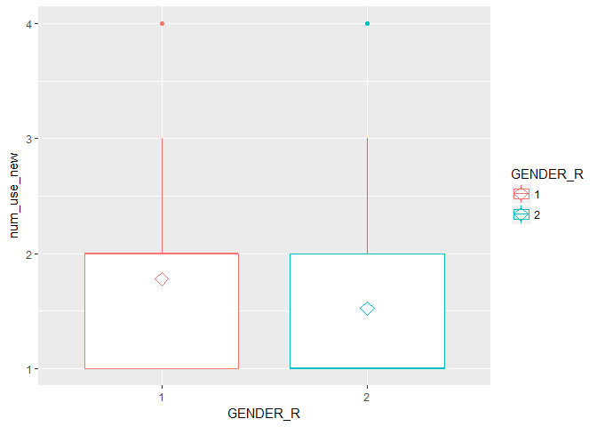

``` r
# lit_use_new vs full/part time
(ggplot(MAIN_data, aes(y=num_use_new, x=Full_part,color=Full_part)) + geom_boxplot()+stat_summary(fun.y=mean, geom="point", shape=23, size=4,color='blue'))
```

    ## Warning: Removed 1 rows containing non-finite values (stat_boxplot).

    ## Warning: Removed 1 rows containing non-finite values (stat_summary).

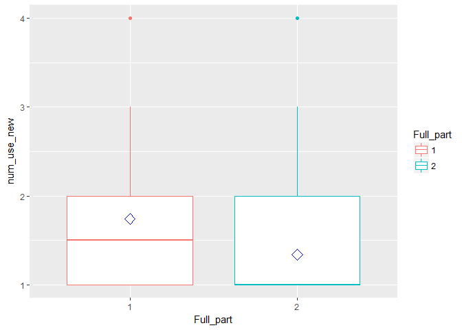

``` r
# lit_use_new vs education
(ggplot(MAIN_data, aes(y=num_use_new, x=ED_Level, color=ED_Level)) + geom_boxplot()+stat_summary(fun.y=mean, geom="point", shape=23, size=4))
```

    ## Warning: Removed 1 rows containing non-finite values (stat_boxplot).

    ## Warning: Removed 1 rows containing non-finite values (stat_summary).

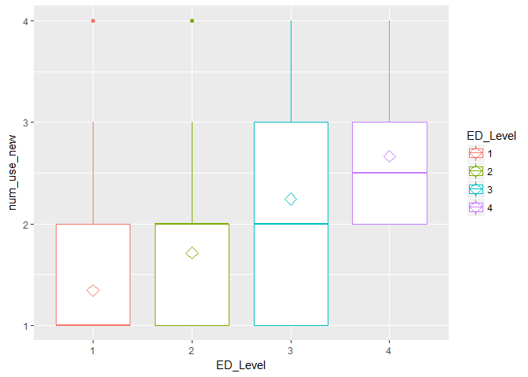

``` r
#MAIN_data_response=na.omit(MAIN_data_response)
# lit_use_new vs private/public

(ggplot(na.omit(MAIN_data[c('num_use_new','pub_priv')]), aes(y=num_use_new, x=pub_priv, color=pub_priv)) + geom_boxplot()+stat_summary(fun.y=mean, geom="point", shape=23, size=4))
```

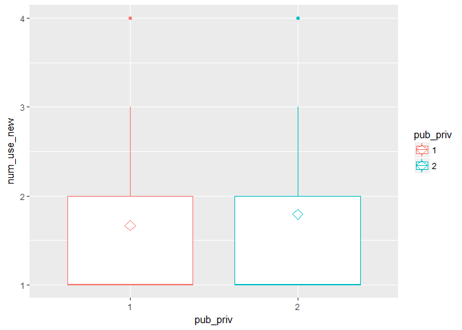

``` r
# lit_use_new vs None formal education
(ggplot(MAIN_data, aes(y=num_use_new, x=NFE12,color=NFE12)) + geom_boxplot()+stat_summary(fun.y=mean, geom="point", shape=23, size=4))
```

    ## Warning: Removed 1 rows containing non-finite values (stat_boxplot).

    ## Warning: Removed 1 rows containing non-finite values (stat_summary).

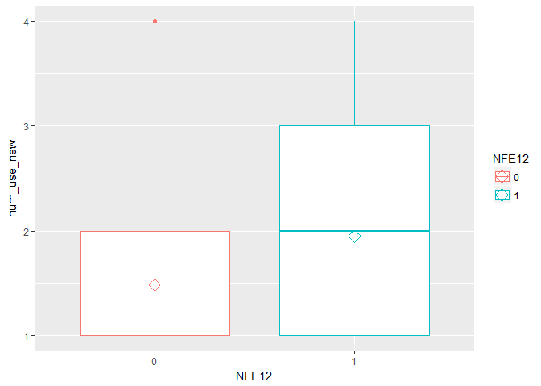

``` r
#meaningful plots
ggarrange(a, b, c,d + rremove("x.text"), 
          labels = c("A", "B", "C","D"),
          ncol = 2, nrow = 2)
```

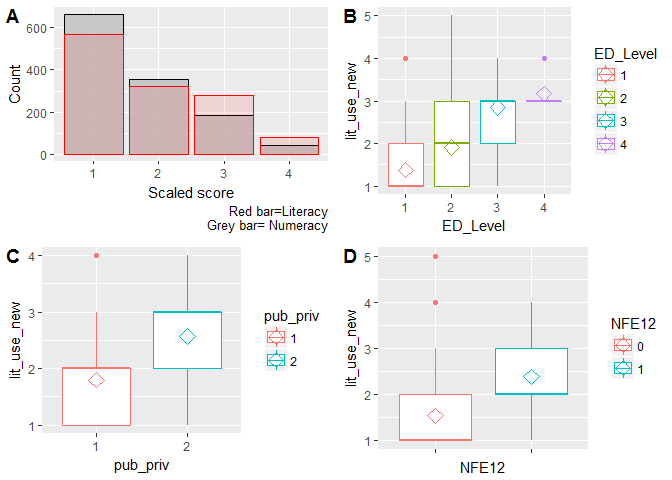

Model Diagnostics
-----------------

``` r
#model diagnostics
#check convergence of the model
convergence(E_Model_Lit)
```

    ##  nobs logLik   niter max.grad cond.H  logLik.Error
    ##  1207 -1077.74 6(0)  4.29e-12 2.0e+06 <1e-10      
    ## 
    ##               Estimate Std.Err  Gradient     Error Cor.Dec Sig.Dig
    ## 1|2           -0.20738 0.88806 -9.16e-15 -4.93e-16      15      15
    ## 2|3            1.67215 0.89008  2.98e-13 -5.35e-16      14      15
    ## 3|4            4.27328 0.89938 -3.70e-13 -8.39e-15      13      14
    ## GENDER_R2     -0.63656 0.13553  3.18e-14  4.51e-16      15      15
    ## AGE_R         -0.06698 0.01510  4.29e-12  9.40e-18      16      15
    ## ED_Level2      0.84020 0.14660  4.00e-14 -3.16e-18      17      17
    ## ED_Level3      1.94713 0.19207  2.52e-14 -2.10e-15      14      15
    ## ED_Level4      1.83970 0.75859 -2.78e-16 -3.75e-15      14      15
    ## Full_part2    -0.71537 0.20251  1.05e-14  4.99e-16      15      15
    ## self_employed -0.22738 0.11400  1.30e-13  5.45e-16      14      14
    ## pub_priv2      0.55063 0.19558  1.39e-14 -8.16e-16      14      14
    ## work_flexM     0.18101 0.05471  2.47e-13 -2.35e-16      15      15
    ## work_lrnM      0.46625 0.06287  2.30e-13 -3.24e-16      15      15
    ## act_lrn        0.64829 0.07522  3.16e-13 -8.35e-17      15      15
    ## NFE121         0.77075 0.13578  3.74e-14 -6.44e-16      14      14
    ## 
    ## Eigen values of Hessian:
    ## 8.633e+05 5.717e+02 2.969e+02 2.403e+02 2.017e+02 1.139e+02 7.735e+01 6.363e+01 6.157e+01 4.832e+01 2.603e+01 2.413e+01 2.118e+01 1.738e+00 4.211e-01 
    ## 
    ## Convergence message from clm:
    ## (0) successful convergence 
    ## In addition: Absolute and relative convergence criteria were met

``` r
convergence(E_Model_Num)
```

    ##  nobs logLik   niter max.grad cond.H  logLik.Error
    ##  1207 -1081.35 6(0)  1.18e-11 2.5e+06 <1e-10      
    ## 
    ##            Estimate  Std.Err  Gradient     Error Cor.Dec Sig.Dig
    ## 1|2         0.16652 0.892709 -1.39e-13  3.83e-15      14      14
    ## 2|3         2.03345 0.894480 -4.58e-14  3.82e-15      14      15
    ## 3|4         4.18923 0.906942 -2.04e-14  3.50e-15      14      15
    ## AGE_R      -0.07615 0.015729  1.18e-11  6.89e-17      15      14
    ## ED_Level2   0.76511 0.149549  8.82e-14  5.35e-17      15      15
    ## ED_Level3   1.35306 0.184270  3.15e-14 -4.56e-16      15      16
    ## ED_Level4   1.59029 0.796150  2.16e-15  4.48e-16      15      16
    ## Full_part2 -0.40541 0.199154  3.32e-14  5.81e-16      14      14
    ## Years_wk    0.01233 0.005334  6.20e-12  1.78e-17      16      15
    ## pub_priv2  -0.48999 0.206113  2.29e-14  1.65e-16      15      15
    ## work_flexM  0.41303 0.052619  7.51e-13  1.60e-16      15      15
    ## work_lrnM   0.32799 0.060964  5.07e-13 -1.65e-16      15      15
    ## act_lrn     0.45927 0.072653  5.93e-13  5.02e-17      15      15
    ## NFE121      0.31809 0.134950  9.87e-14  1.10e-16      15      15
    ## 
    ## Eigen values of Hessian:
    ## 1.044e+06 3.130e+04 5.368e+02 2.856e+02 2.440e+02 2.082e+02 9.019e+01 6.471e+01 5.453e+01 2.697e+01 2.496e+01 1.985e+01 1.579e+00 4.163e-01 
    ## 
    ## Convergence message from clm:
    ## (0) successful convergence 
    ## In addition: Absolute and relative convergence criteria were met

``` r
#these tests can be viewed as goodness-of-fit tests. With the logit link, nominal_test provides likelihood ratio tests of the proportional odds assumption.
T_Model_Lit<-clm(lit_use_new ~ GENDER_R + AGE_R + ED_Level + Full_part + self_employed + pub_priv + work_flexM + work_lrnM + act_lrn + NFE12,data=Lit_data_clean)
T_Model_Num<-clm(num_use_new ~ AGE_R + ED_Level + Full_part + Years_wk + pub_priv + work_flexM + work_lrnM + act_lrn + NFE12,data=Num_data_clean)
#the proportional oadds assumption test for literacy model
nominal_test(T_Model_Lit)
```

    ## Tests of nominal effects
    ## 
    ## formula: lit_use_new ~ GENDER_R + AGE_R + ED_Level + Full_part + self_employed + pub_priv + work_flexM + work_lrnM + act_lrn + NFE12
    ##               Df  logLik    AIC    LRT Pr(>Chi)  
    ## <none>           -1077.7 2185.5                  
    ## GENDER_R       2 -1076.0 2186.0 3.4559  0.17765  
    ## AGE_R          2 -1077.6 2189.1 0.3639  0.83363  
    ## ED_Level                                         
    ## Full_part      2 -1076.9 2187.8 1.7426  0.41840  
    ## self_employed  2 -1075.8 2185.6 3.8852  0.14333  
    ## pub_priv       2 -1077.3 2188.7 0.8057  0.66843  
    ## work_flexM     2 -1075.8 2185.6 3.9134  0.14132  
    ## work_lrnM      2 -1074.1 2182.3 7.2312  0.02690 *
    ## act_lrn        2 -1074.5 2183.0 6.4814  0.03914 *
    ## NFE12          2 -1077.5 2188.9 0.5603  0.75567  
    ## ---
    ## Signif. codes:  0 '***' 0.001 '**' 0.01 '*' 0.05 '.' 0.1 ' ' 1

``` r
#the proportional oadds assumption test for numeracy model
nominal_test(T_Model_Num)
```

    ## Tests of nominal effects
    ## 
    ## formula: num_use_new ~ AGE_R + ED_Level + Full_part + Years_wk + pub_priv + work_flexM + work_lrnM + act_lrn + NFE12
    ##            Df  logLik    AIC     LRT Pr(>Chi)   
    ## <none>        -1081.3 2190.7                    
    ## AGE_R       2 -1081.0 2193.9  0.7966 0.671469   
    ## ED_Level    6 -1077.8 2195.5  7.1578 0.306497   
    ## Full_part   2 -1079.7 2191.4  3.3268 0.189491   
    ## Years_wk    2 -1081.1 2194.3  0.4367 0.803857   
    ## pub_priv    2 -1078.3 2188.6  6.0794 0.047848 * 
    ## work_flexM  2 -1078.4 2188.7  5.9623 0.050735 . 
    ## work_lrnM   2 -1081.0 2193.9  0.7690 0.680797   
    ## act_lrn     2 -1076.0 2184.1 10.5971 0.004999 **
    ## NFE12       2 -1079.5 2191.0  3.6924 0.157834   
    ## ---
    ## Signif. codes:  0 '***' 0.001 '**' 0.01 '*' 0.05 '.' 0.1 ' ' 1
